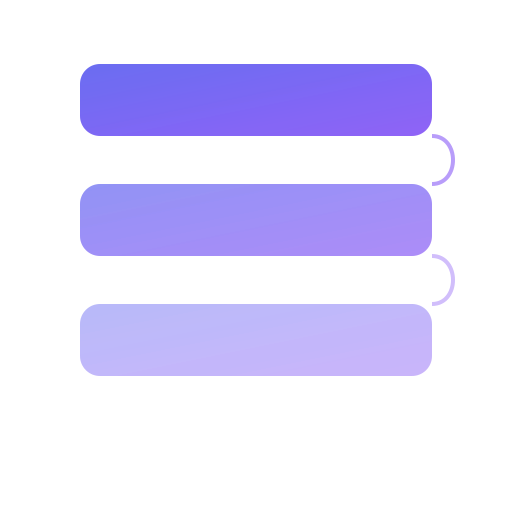

<p align="center">
  
</p>

<h1 align="center">Slabs</h1>

<p align="center">
  Self-hostable, offline-first note-taking.<br>
  Your notes, your server, your rules.
</p>

<p align="center">
  <a href="https://github.com/notcubik/slabs/actions/workflows/ci.yml"></a>
  <a href="LICENSE"></a>
  <a href="https://github.com/notcubik/slabs/tags"></a>
</p>

---

## Quick Start

```bash
docker compose up -d
```

Open **http://localhost:3000** and create your admin account.

## Features

- **Rich notes** — Markdown, checklists, image attachments
- **Tags** — Custom tags, multi-tag filtering, tag management
- **Themes** — Independent light/dark mode + 6 accent colors (Slate, Amber, Emerald, Ocean, Rose, Violet)
- **Save state** — Visual save indicator, explicit save button, auto-save
- **Search** — Full-text across titles, content, and tags
- **Version history** — Browse and restore previous versions
- **Sharing** — Collaborate with other users, public share links
- **Offline-first** — PWA with IndexedDB + CRDT sync
- **MCP server** — AI assistants can manage your notes
- **Multi-user** — Argon2 auth + OAuth/SSO (Google, GitHub, OIDC)

## Tech Stack

| Layer | Technology |
|-------|-----------|
| Framework | SvelteKit 2 + Svelte 5 runes |
| UI | Tailwind CSS 4, DM Sans, Space Grotesk |
| Database | SQLite + Drizzle ORM |
| Auth | Argon2 + session cookies + OAuth/SSO |
| Sync | LWW CRDTs over IndexedDB |
| Testing | Vitest + Playwright |
| Deploy | Docker (multi-stage) or Node.js |

## Documentation

| | |
|---|---|
| [Features](docs/FEATURES.md) | Full feature list |
| [Architecture](docs/ARCHITECTURE.md) | System design, sync, schema |
| [Auth](docs/AUTH.md) | Password + OAuth/SSO setup |
| [Deployment](docs/DEPLOYMENT.md) | Docker, reverse proxy, backups |
| [API](docs/API.md) | REST API reference |

## Deploy on Your Server

See **[DEPLOYMENT.md](docs/DEPLOYMENT.md)** for a complete guide covering:
- Docker Compose setup with HTTPS (Caddy/Nginx)
- OAuth/SSO configuration
- Email notifications (SMTP)
- Backups and updates

## Development

```bash
pnpm install
pnpm dev          # Start dev server
pnpm check        # Type checking
pnpm test         # Unit + E2E tests
pnpm build        # Production build
```

## License

[MIT](LICENSE)

---

*Slabs is a fork of [Crumbs](https://github.com/bretzel-app/crumbs), an open-source note-taking app by Bretzel.*
